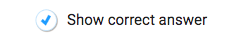

# corespring-correct-answer-toggle

[](https://travis-ci.org/PieLabs/corespring-correct-answer-toggle)

A toggle with an icon and a label.



# Usage 

You need to include this in another library that builds react aka (babel).

## Webpack

We assume that you have a loader that will load in `.less`. In the demo we use `style-loader!css-loader!less-loader`.

## Install 

```shell 
npm install 
```
## Test 

```
npm test
```

## Demo 

```shell 
cd demo 
../node_modules/.bin/webpack-dev-server --hot --inline
# go to http://localhost:8080
```

### Usage
```javascript

import Toggle from 'corespring-correct-answer-toggle'; 

function onToggle(toggled){
  console.log('on toggle: ', toggled);
}

const MyComp = (props) => {
  return <div>
    <Toggle 
      show={props.show} 
      onToggle={onToggle} 
      initialValue={false}/>
  </div>;
}
```

## Release 

```shell
gulp release
git checkout master
npm publish
```


